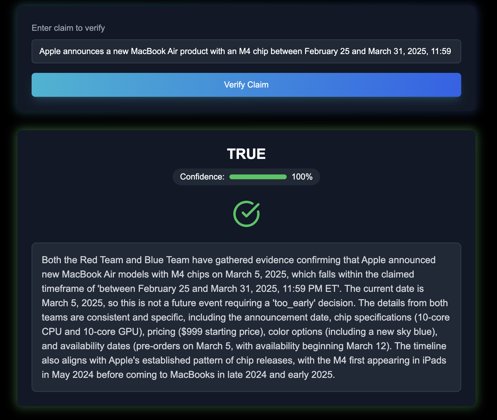

# Prophet.ai - Agentic Prediction Market

## Table of Contents
- [Overview](#overview)
- [The Problem](#the-problem)
  - [Case Study: Polymarket Disputed Resolution](#case-study-polymarket-disputed-resolution)
- [Our Solution](#our-solution)
  - [Key Benefits](#key-benefits)
- [How Prophet AI Works](#how-prophet-ai-works)
  - [Agentic Verification Mechanism](#agentic-verification-mechanism)
  - [Blockchain Infrastructure](#blockchain-infrastructure)
  - [System Participants](#system-participants)
  - [Verification Workflow](#verification-workflow)
- [Getting Started](#getting-started)
  - [Installation](#installation)
  - [Configuration](#configuration)
  - [Running the Agent](#running-the-agent)
  - [Running the Prediction Market](#running-the-prediction-market)
- [Examples & Case Studies](#examples--case-studies)
  - [Scientific Claims](#scientific-claims)
  - [Health-Related Claims](#health-related-claims)
  - [Technology Release Claims](#technology-release-claims)

## Overview

Prophet.ai is a Prediction market that leverages AI agents for claim verification. By combining advanced AI with blockchain infrastructure, Prophet.ai enables unbiased and censorship-resistant claim verification.

## The Problem

Popular **prediction markets** use optimistic oracles like UMA which have several significant challenges:

- **Oracle Manipulation**: Vulnerable to price manipulation during disputes despite "priceless contracts"
- **Centralization**: Concentrated token ownership (98% retained by team) limits decentralization
- **Slow Dispute Resolution**: Token-holder voting system creates delays for time-sensitive applications
- **Security Economics**: Relies on attack costs exceeding potential profits; vulnerable during market extremes
- **Limited Oracle Infrastructure**: Minimal architecture creates vulnerabilities when robust alternatives aren't available

### Case Study: Polymarket Disputed Resolution

The claim "Trump declassifies Epstein list in first 100 days?" was resolved to "Yes" on Polymarket, leading to significant user disputes:


Users strongly contested this resolution:


Prophet AI provides a more nuanced and appropriate response, concluding it is **too early** to resolve the market. Not enough substantive evidence has been released to resolve to "Yes," and the 100-day deadline has not been reached yet.


## Our Solution

Prophet.ai leverages AI agents alongside blockchain infrastructure to prevent bias and ensure censorship resistance in oracle solutions for prediction markets.

### Key Benefits

- **Multi-source Verification**: AI agents access Internet data through multiple sources
- **Diverse LLM Processing**: Information is processed using various LLMs in a jury-like architecture
- **Decentralized Decision-making**: Simulated agents debate for and against claims
- **Censorship Resistance**: Runs on multiple instances across TEE operators.
- **Transparent Results**: Final aggregation evaluates evidence and delivers clear resolutions

The Prophet AI agent runs on multiple instances across a network of TEEs. TEEs ensure that Prophet Agents operators are running genuine Prophet instances. Users submit requests for claim verification via an on-chain smart contract, and an available operator picks up the task, executes the agent, and submits the verified result back on-chain.

## How Prophet AI Works

### Agentic Verification Mechanism

The agentic mechanism used by Prophet to evaluate a claim is described below:


1. **Research Phase**: After receiving a claim or statement, Prophet Agents leverages two teams of simulated agents:
   - **Blue Team**: Argues in favor of the claim
   - **Red Team**: Argues against the claim

   Each team conducts comprehensive research using multiple search providers:
   - Tavily
   - Exa
   - Serper
   - Perplexity
   - Twitter

   A *team aggregator* builds the strongest possible case from the evidence. Note that each aggregator need not agree with its team if the evidence is inadequate.

2. **Evidence Evaluation**: Team aggregators' statements are submitted to a final aggregator for evaluation.

3. **Assessment Generation**: The final aggregator produces a detailed report including:
   - Supporting evidence
   - Confidence score (0-100%)
   - One of the following resolutions:
     - **True**: Claim is accurate based on evidence
     - **False**: Claim is inaccurate based on evidence
     - **Inconclusive**: Insufficient evidence to decide
     - **Depends**: Claim requires additional context
     - **Too early**: Evidence will become available in the future

### Blockchain Infrastructure

Prophet utilizes an agentic workflow in a decentralized architecture that combines AI-powered research with blockchain verification.

### System Participants

The following parties interact in the Prophet network:

1. **Market Creators**: Submit claims to be verified along with payment
2. **Operators**: Run instances of Prophet Agents in TEEs and register on the operator registry smart contract
3. **Smart Contract System**: Manages verification process, operator registration, and TEE verification

### Verification Workflow

1. **Operator Registration**: Operators run Prophet AI agent in a TEE and register on the OperatorRegistry contract
2. **Claim Submission**: Market creators submit claims with payment through the smart contract
3. **Task Assignment**: Tasks are assigned based on submission timestamp
4. **Task Execution**: Operators run claim verification on the Prophet AI agent
5. **On-chain Verification**: Assessment is submitted to the blockchain as a permanent record
6. **Payment Processing**: Operators receive payment, and users receive verification results

*Note: Prophet only submits verification results on-chain without detailed reports due to gas considerations.*

## Getting Started

### Installation

```bash
git clone https://github.com/hfarazul/Agentic-Prediction-Market
cd Agentic-Prediction-Market
pnpm install
cp .env.example .env
```

### Configuration

Fill the following fields in your `.env` file:

```
ANTHROPIC_API_KEY=
TAVILY_API_KEY=
EXA_API_KEY=
PERPLEXITY_API_KEY=
```

### Running the Agent

```bash
pnpm build && pnpm start
```

### Running the Prediction Market

```bash
cd frontend
pnpm install --ignore-workspace
pnpm dev
```

Navigate to the local development server to interact with Prophet.ai and its agents through the UI.

## Examples & Case Studies of Prophets Agents

### Scientific Claims

**Claim: Humans only use 10% of their brains**


### Health-Related Claims

**Claim: 5G networks are harmful to human health**


### Technology Release Claims

**Polymarket Case Study: Macbook Air M4 released before April?**




This resolved to "Yes" on Polymarket, which Prophet AI agents agrees with, demonstrating consensus in clear cases.
